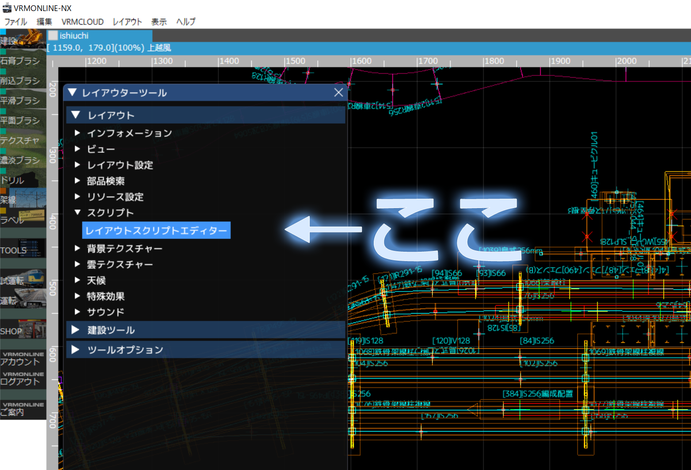
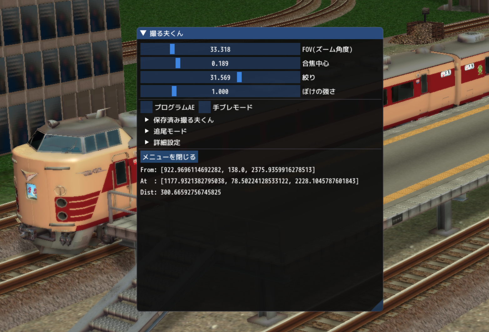

# 撮る夫くん　クイックスタート

## ダウンロードとインストール

**撮る夫くん Ver. 3.4.0 からpipでのインストール方法が推奨になりました。**

```note::
    撮る夫くん Ver.3.4.0 以降、他のPythonパッケージに依存するようになりました。
    依存パッケージのインストールを同時に行えるよう、pipでのインストールが推奨になりました。

    従来のような、レイアウトと同じフォルダに _toruo.py_ のみを置く方法では、
    依存パッケージが存在しないときに `ModuleNotFoundError` が発生し、撮る夫くんが動作しなくなります。
```

pipで、撮る夫くんをGitHubからインストールするコマンドは以下のようになります。（通常のインストール先の場合。）
スタートメニューからコマンドプロンプトを立ち上げ、コマンドを入力して実行してください。

VRM NXの方：

```bat
"%programfiles%\i.magic\鉄道模型シミュレーターNX\python\python.exe" -m pip install git+https://github.com/AKAGI-Rails/vrmnx-toruo.git -t "%programfiles%\i.magic\鉄道模型シミュレーターNX\python\Lib\site-packages"
```

VRM Online NXの方：

```bat
"%programfiles%\i.magic\鉄道模型シミュレーターオンラインNX\python\python.exe" -m pip install git+https://github.com/AKAGI-Rails/vrmnx-toruo.git -t "%programfiles%\i.magic\鉄道模型シミュレーターオンラインNX\python\Lib\site-packages"
```

アップデート、アンインストールの際は、`install`コマンドのかわりに、`update` または `uninstall`コマンドを使ってください。

## レイアウトで撮る夫くんを有効にする

撮る夫くんを有効にするには，レイアウトスクリプトに2行書き加えます。



1. ``import`` 文を記述します。
2. イベントハンドラの冒頭に ``activate()`` を記述します。

```python
import vrmnx
import toruo  # インポート文を記述する

def vrmevent(obj,ev,param):
    toruo.activate(obj,ev,param)  # activateを記述する
    if ev == 'init':
        pass 
    # 以下省略
```

## 撮る夫くんの操作方法

ビュワーで `p` キーを押すと撮る夫くんの操作パネルが開きます。



もう一度 `p` キーを押すか，操作パネル下部の「メニューを閉じる」ボタンで
撮る夫くんパネルが隠れます。

### FOV (Field of View)

画角を設定します。数字が小さいほどズームになります。

### 合焦距離

数字が小さいほど遠くに，数字が大きいほど近くにピントが合います。

VRMNX上の距離(mm)の逆数の4乗根の数字になっています。
つまり，距離を$d$, 合焦距離のパラメータを$x$として，

$$ x = d^{-1/4} $$

です。

### F値

一眼レフカメラのF値と同様です。
数字が大きいほど，被写界深度が広くなり，広い範囲にピントが合うようになります。

### ぼけの強さ

読んで字の如く。

### プログラムAE

FOV操作にF値, ぼけの強さを連動させ，操作がカンタンになります。

### ゲームパッド操作

__(Ver. 3.4.0 で追加)__
ゲームパッドが接続されているときに、GUIパネルから撮る夫くん操作を有効にすると、
ゲームパッドでグローバルカメラの視点が操作できるようになります。


| 入力 | 操作 |
| ---- | ---- |
| 左スティック | 水平移動 |
| 右スティック | 視線移動（見回し） |
| L1/R1       | 垂直移動 |
| 十字キー上下 | フォーカス遠近 |
| 十字キー左右 | ズーム |
| Aボタン | ダッシュ（水平・垂直移動の加速） |
| Bボタン | スクリーンショットの撮影 |

ボタン配置はX-inputです。

## 撮る夫くんの視点保存

現在の視点を保存しておき，次回以降にビュワーを起動したときに
ボタン操作で同じ視点を復元することができます。

```note::
    撮る夫くんを保存すると，レイアウトと同じファイルにtoruo.jsonというファイルを生成します。
    このファイルにカメラ座標などのデータが記録されています。

    このファイルは，同一フォルダにあるレイアウト全体で共有する仕様です。
```

不要になった保存済み撮る夫くんは，フォーカス中に「削除」ボタンを押すと登録を削除できます。

## 車両追尾

レイアウト内の走行車両を追尾することができます。

追尾車両と，追尾位置（車両のローカル座標）もダイアログから設定することができます。

## 撮影環境設定

太陽の緯度・経度が撮る夫くんからリアルタイムで変更できます。

## 詳細設定

ズームとぼけの設定パラメータを数値入力できます。

また，プログラムAEの詳細パラメータを設定できます。実写風～鉄道模型風のテイストを調整できます。

### グローバルカメラ from-to距離設定

車両追尾で遠距離の追尾を行ったあとで，グローバルカメラのターゲット座標（追尾車両の位置）に合わせてシャドウマップの生成範囲が遠方になってしまう場合があります。
この項目から適当な距離にfrom-to距離をリセットすると，現在の視点をキープしたまま，グローバルカメラのターゲット座標を指定距離に移動させることができます。シャドウマップも連動して生成範囲が変更されます。

なお，ここの入力フォームはリアルタイム処理になっておらず，ボタンを押したときにのみ設定が反映されます。
車両追尾によりターゲット座標までの距離が変化していても反映はされません。
（実行速度を優先した仕様になります。）
